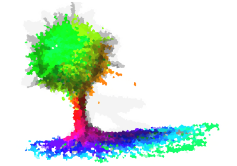
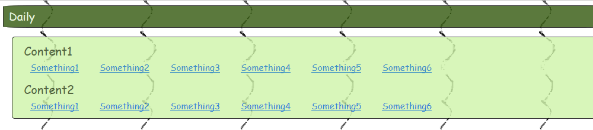
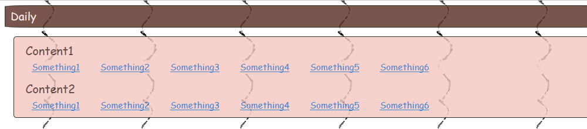
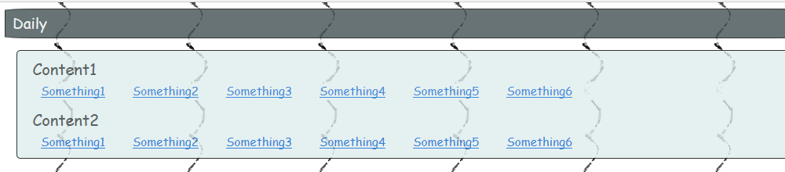

SeasonReminder
===



## 概要
    Webページを季節にあわせた色合に変化させます。
    春は若葉色に、夏は暑そうな色に、秋は枯葉色に、冬は寒そうな色に。
    
## コード例
背景と文字の色を変える例    
```HTML
    <script src="season-reminder.js"></script>
    <script>
    function initializeSeasonalDesign() {
        var reminder = new SeasonReminder();
        
        // 背景色は季節を色濃く反映する
        reminder.seasonInfluence = 50;
        reminder.remindAll("backgroundColor");

        // 文字・線の色は季節を淡く反映する
        reminder.seasonInfluence = 10;
        reminder.remindAll("color");
        reminder.remindAll("borderColor");
    }

    // 季節を反映するロードイベントを追加する
    window.addEventListener('load', initializeSeasonalDesign);
    </script>
```

## 外見の例
    立春・夏至・秋分・冬至を反映したイメージ。



